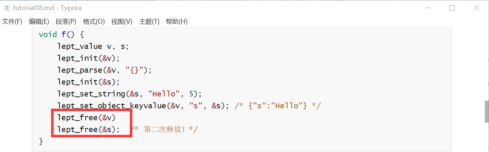

# 07/27

## 对象键值查询

~~~c
#define LEPT_KEY_NOT_EXIST ((size_t)-1)

size_t lept_find_object_index(const lept_value* v, const char* key, size_t klen) {
    size_t i;
    assert(v != NULL && v->type == LEPT_OBJECT && key != NULL);
    for (i = 0; i < v->u.o.size; i++)
        if (v->u.o.m[i].klen == klen && memcmp(v->u.o.m[i].k, key, klen) == 0)
            return i;
    return LEPT_KEY_NOT_EXIST;
}}
~~~

`((size_t)-1)` 是将 `-1` 强制转换为 `size_t` 类型的操作，

`memcmp` 函数是 C 语言标准库中用于比较两块内存区域的内容的函数。它按照字节的二进制值进行逐字节比较，并返回比较结果。

## 相等比较

对于 true、false、null 这三种类型，比较类型后便完成比较；对于数字和字符串，需进一步检查是否相等；

~~~c
int lept_is_equal(const lept_value* lhs, const lept_value* rhs) {
    assert(lhs != NULL && rhs != NULL);
    if (lhs->type != rhs->type)
        return 0;
    switch (lhs->type) {
        case LEPT_STRING:
            return lhs->u.s.len == rhs->u.s.len && 
                memcmp(lhs->u.s.s, rhs->u.s.s, lhs->u.s.len) == 0;
        case LEPT_NUMBER:
            return lhs->u.n == rhs->u.n;
        /* ... */
        default:
            return 1;
    }
}
~~~

对于数组和对象这种复合类型，

对于数组，我们先比较元素数目是否相等，然后递归检查对应的元素是否相等：

~~~c
int lept_is_equal(const lept_value* lhs, const lept_value* rhs) {
    size_t i;
    /* ... */
    switch (lhs->type) {
        /* ... */
        case LEPT_ARRAY:
            if (lhs->u.a.size != rhs->u.a.size)
                return 0;
            for (i = 0; i < lhs->u.a.size; i++)
                if (!lept_is_equal(&lhs->u.a.e[i], &rhs->u.a.e[i]))
                    return 0;
            return 1;
        /* ... */
    }
}
~~~

注意比较元素的时候是个嵌套使用

对象与数组的不同之处，在于概念上对象的键值对是无序的。例如，`{"a":1,"b":2}` 和 `{"b":2,"a":1}` 虽然键值的次序不同，但这两个 JSON 对象是相等的。

解决办法:利用`lept_find_object_index()`递归进行比较

## 复制移动和交换

设计接口方便修改

为对象设立键值

要么深度复制

~~~c
void lept_copy(lept_value* dst, const lept_value* src) {
    size_t i;
    assert(src != NULL && dst != NULL && src != dst);
    switch (src->type) {
        case LEPT_STRING:
            lept_set_string(dst, src->u.s.s, src->u.s.len);
            break;
        case LEPT_ARRAY:
            /* \todo */
            break;
        case LEPT_OBJECT:
            /* \todo */
            break;
        default:
            lept_free(dst);
            memcpy(dst, src, sizeof(lept_value));
            break;
    }
}
~~~

要么浅层copy

## 动态数组

原来数组的元素是不变的，增删的时候需要重新分配，

改动也很简单，只需要在数组中加入容量 `capacity` 字段，表示当前已分配的元素数目，而 `size` 则表示现时的有效元素数目：

~~~c
        /* ... */
        struct { lept_value* e; size_t size, capacity; }a; /* array:  elements, element count, capacity */
        /* ... */
~~~

不明白的是到底是`capacity`表示容量，`size`表示的是已经分配的

动态对象是一样的操作

